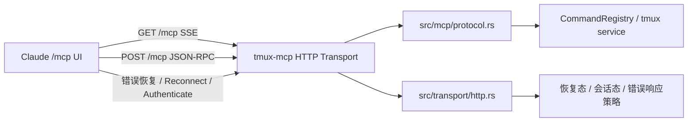

# Dev Plan: Claude MCP 失败态恢复修复

## 输入前置条件表

| 类别 | 内容 | 是否已提供 | 备注 |
|------|------|------------|------|
| 仓库/模块 | `src/main.rs`、`src/mcp/protocol.rs`、`src/transport/mod.rs`、`tests/streamable_http.rs`、`tests/multi_client_http.rs`、`scripts/repro_claude_mcp_failed_state.sh` | 是 | 受影响范围已能定位到协议层、传输层、回归脚本与测试目录 |
| 目标接口 | `GET /mcp`、`POST /mcp`、Claude 交互式 `/mcp` 详情页中的 `Reconnect` / `Authenticate` 恢复路径 | 是 | 交互式 Claude UI 为关键消费端，Rust 服务为被修复对象 |
| 运行环境 | Rust 2021、`tokio` 1.x、`axum` 0.7、`reqwest` 0.11、Claude Code 2.1.113、本地 HTTP 端点 `127.0.0.1:8090` | 是 | 运行环境来自 `Cargo.toml`、调试日志与当前仓库 |
| 约束条件 | 以 `scripts/repro_claude_mcp_failed_state.sh` 作为故障复现与回归标准；本次只写计划不写实现；修复后不能依赖“手工 kill server 再重进 Claude” | 是 | 用户已明确提出 |
| 已有测试 | `tests/streamable_http.rs` 覆盖基础 Streamable HTTP 行为；`tests/multi_client_http.rs` 仍是占位；已有手工复现脚本 | 是 | 当前没有真正覆盖 Claude 失败态恢复的自动化集成测试 |
| 需求来源 | 本次对话、已确认的 Claude debug 日志现象、仓库内复现脚本 | 是 | 属于调试后的修复计划请求 |

### 输入信息处理规则

- 当前信息足够生成实施计划，但仍存在两项执行期不确定性：Claude 内部失败态缓存机制不可见、Claude 本地 token 存储结构不在本仓库内。
- 对于无法直接从仓库确认的客户端行为，本计划会以“假设 + 风险 + 回归验证”方式处理，不把不确定事实写成确定事实。
- 若后续执行中发现 Claude 的失败态完全由客户端缓存逻辑主导，则服务端修复需要收缩为“兼容性缓解 + 明确文档说明”，并在风险中升级标记。

## 1. 概览（Overview）

- 一句话目标：修复 `tmux-mcp` 在 Claude 交互式 `/mcp` 中的失败态恢复链路，使服务恢复后无需 kill 进程即可重新连接，并避免误入错误的 OAuth 认证路径。
- 优先级：`[P0]`
- 预计时间：1.5 到 2.5 个工作日
- 当前状态：`[PLANNING]`
- 需求来源：本次调试结论、仓库内复现脚本 `scripts/repro_claude_mcp_failed_state.sh`、现有 Streamable HTTP 实现与测试
- 最终交付物：协议修复方案落地说明、文件级改动清单、回归测试策略、以复现脚本为标准的验收门禁

## 2. 背景与目标（Background & Goals）

### 2.1 为什么要做（Why）

当前 `tmux-mcp` 的基础连通性正常，但在 Claude 交互式 `/mcp` 的失败恢复路径中存在两个高优先级问题：

1. 当 `127.0.0.1:8090` 在会话启动时不可达时，Claude 会将 `tmux-mcp` 标记为 `failed / not authenticated`。
2. 即使服务随后恢复，同一个 Claude 会话中的 `/mcp` 详情页仍停留在失败态，恢复体验不稳定。
3. 若用户在该失败态下选择 `Authenticate`，Claude 会进入 OAuth 探测路径，而当前服务对该误路径返回 `404 + 空体`，进一步触发 `SDK auth failed: Invalid OAuth error response`。

当前痛点不是“服务完全不可用”，而是“失败后恢复不可靠，且错误恢复路径会污染用户认知”。触发原因是现有传输实现只覆盖了最小可用 Streamable HTTP 行为，没有把失败态恢复、会话恢复、防御性无认证兼容处理纳入协议设计。预期收益是：

- 本地 tmux MCP 在 Claude 中具备稳定的失败后恢复能力。
- 复现脚本可以从一次性诊断工具升级为长期回归门禁。
- 交互式用户不再被错误引导到无效认证流程。

### 2.2 具体目标（What）

1. 使服务端在“服务短暂不可用后恢复”的场景下，对 Claude 的重连路径提供明确且兼容的传输行为。
2. 消除 `Authenticate` 误路径上的 `404 + 空体` 行为，避免再出现 `Invalid OAuth error response`。
3. 将 `scripts/repro_claude_mcp_failed_state.sh` 升级为回归标准，使其能够稳定判定“故障仍存在”或“修复已生效”。
4. 为 Rust 侧新增至少一组自动化测试，覆盖连接初始化、失败后恢复、无认证防御路径中的关键协议断言。
5. 保持现有 `tools/list`、`resources/list`、`initialize` 等基础 MCP 功能不发生行为回归。

### 2.3 范围边界、依赖与风险（Out of Scope / Dependencies / Risks）

| 类型 | 内容 | 说明 |
|------|------|------|
| Out of Scope | 修改 Claude Code 客户端源码或其本地 token 存储实现 | 本仓库无法直接修复客户端内部状态缓存 |
| Out of Scope | 变更 tmux 工具语义、命令执行逻辑、command registry TTL 策略 | 本次只处理 MCP 传输恢复与兼容性 |
| Out of Scope | 引入真实 OAuth 登录能力 | 目标是本地无认证 HTTP 服务的稳定兼容，不是新增认证系统 |
| Dependencies | MCP Streamable HTTP 官方传输约定 | 需要基于官方文档校准会话、SSE、恢复与错误响应行为 |
| Dependencies | Claude Code 当前版本的 `/mcp` 交互恢复行为 | 修复需对真实消费端有效，而不仅是对 `reqwest` 测试有效 |
| Dependencies | 现有 `axum`/`tokio` 运行方式与路由结构 | 避免大幅偏离当前架构 |
| Risks | 客户端失败态缓存可能仍主导最终 UI 展示 | 服务端即便修复协议，也可能只能做到“Reconnect 成功但列表刷新滞后” |
| Risks | 新增会话或恢复语义可能引入旧客户端兼容问题 | 需要保证 stateless 使用方式不被破坏 |
| Risks | 误判 OAuth 探测期望，导致新的不兼容行为 | 需要先校对官方 transport / auth 约定后再实现 |
| Assumptions | Claude 对本地 HTTP MCP 的恢复失败，至少部分受服务端传输/错误响应影响 | 若假设不成立，则需要把方案收缩为兼容性缓解 |
| Assumptions | `scripts/repro_claude_mcp_failed_state.sh` 可作为主要验收标准，并在修复后演化为“应成功通过”的脚本 | 用户已明确接受该脚本作为标准 |

### 2.4 成功标准与验收映射（Success Criteria & Verification）

| 目标 | 验证方式 | 类型 | 通过判定 |
|------|----------|------|----------|
| 服务恢复后可重新连接 | 运行 `bash scripts/repro_claude_mcp_failed_state.sh` 的修复后版本 | 自动 | 脚本不再停留在 `stale_failed_after_server_restart`，而是观察到可恢复或显式成功状态 |
| 错误 auth 路径不再返回 404 空体 | 复现脚本中的认证分支检查 + 新增协议测试 | 自动 | 不再出现 `SDK auth failed: HTTP 404: Invalid OAuth error response` |
| 基础 MCP JSON-RPC 行为不回归 | `cargo test --test streamable_http` | 自动 | 现有用例全部通过，且新增恢复相关断言通过 |
| 传输层修改不破坏工程质量门禁 | `cargo fmt --all`、`cargo clippy --workspace --all-targets --all-features -- -D warnings` | 自动 | 格式化与 lint 全部通过 |
| Claude 交互体验符合预期 | 在 Claude 交互式 `/mcp` 中手工验证 `tmux-mcp` 恢复路径 | 人工 | 服务恢复后不需要 kill Claude/kill server 才能重新使用 `tmux-mcp` |

## 3. 技术方案（Technical Design）

### 3.1 高层架构



系统结构关系需要从“单文件最小协议实现”升级为“协议处理 + 传输恢复策略”双层结构。`src/mcp/protocol.rs` 继续负责 JSON-RPC 语义，而新的 transport 层负责 Claude 关心的恢复、安全错误响应、会话/重连兼容处理。

### 3.2 核心流程

1. Claude 正常启动时，通过 `POST /mcp` 完成 `initialize`，通过 `GET /mcp` 建立 SSE。
2. 若服务暂时不可达，Claude 会进入失败态；服务恢复后，`Reconnect` 必须命中一个可重新建立连接的服务端路径，而不是继续沿用已失效状态。
3. 若用户误点 `Authenticate`，服务端必须返回“兼容且可解析”的无认证响应，不能再返回空体 404。
4. 回归脚本与 Rust 自动化测试共同验证上述流程，确保该问题不会再次引入。

### 3.3 技术栈与运行依赖

- 语言 / 框架：Rust 2021、`tokio`、`axum`
- 数据库：无
- 缓存 / 队列 / 中间件：无外部缓存；内部状态为 `CommandRegistry`
- 第三方服务：本地 `tmux`、Claude Code 作为消费端
- 构建、测试、部署相关依赖：`cargo`、`reqwest`（测试）、`expect`（复现脚本）

### 3.4 关键技术点

- `[CORE]` 将当前“仅最小可用”的 Streamable HTTP 实现收敛为“对 Claude 失败态恢复友好”的传输设计。
- `[CORE]` 为误入认证路径的本地无认证服务提供安全、防御性的响应，不让 Claude 再拿到空体 404。
- `[NOTE]` 需要明确区分“服务端真实修复”与“Claude 客户端缓存导致的残余 UI 问题”。
- `[NOTE]` 回归标准以复现脚本为主，但仍需补充 Rust 自动化断言，避免把所有验证都压在交互式脚本上。
- `[OPT]` 借机把 `src/transport/` 从占位模块变成实际承载 HTTP 传输逻辑的目录。
- `[COMPAT]` 不能破坏当前 `reqwest`/其他 MCP 客户端的无认证基础用法。
- `[ROLLBACK]` 若新的 transport 兼容层引入客户端回归，应能退回到现有 `src/mcp/protocol.rs` 直连路由结构。

### 3.5 模块与文件改动设计

#### 模块级设计

- `src/mcp/`：保留 JSON-RPC 方法分发、请求体解析、工具/资源语义。
- `src/transport/`：新增实际 HTTP transport 管理逻辑，负责恢复态、错误态、防御性响应、会话兼容层。
- `tests/`：新增专门的恢复回归测试，不再只覆盖 happy path。
- `scripts/`：把当前复现脚本演进为长期回归门禁。
- 文档层：同步 README 中关于“stateless Streamable HTTP”的表述，避免继续把当前实现描述得比实际兼容性更完整。

#### 文件级改动清单

| 类型 | 路径 | 说明 |
|------|------|------|
| 新增 | `src/transport/http.rs` | 抽离并承载 HTTP transport 恢复与错误响应逻辑 |
| 新增 | `tests/claude_reconnect_regression.rs` | 面向 Claude 恢复链路的 Rust 侧回归测试 |
| 修改 | `src/main.rs` | 使用新的 transport 组装路由与共享状态 |
| 修改 | `src/lib.rs` | 暴露新增 transport 模块 |
| 修改 | `src/mcp/protocol.rs` | 与 transport 分层协作，收缩为协议语义处理 |
| 修改 | `src/transport/mod.rs` | 从占位说明升级为真实模块导出 |
| 修改 | `tests/streamable_http.rs` | 补充恢复 / 错误响应 / 兼容性断言 |
| 修改 | `scripts/repro_claude_mcp_failed_state.sh` | 从“复现故障”改为“验证修复通过”的门禁脚本 |
| 修改 | `README.md` | 更新传输恢复与验证方式说明 |
| 修改 | `README_zh.md` | 更新中文文档说明 |
| 删除 | 无 | 当前计划不涉及删除文件 |

### 3.6 边界情况与异常处理

- 服务在 `GET /mcp` 建流前不可达，随后恢复。
- 服务在已建立 SSE 后中断，再次恢复。
- 客户端在失败态下点击 `Reconnect`。
- 客户端在失败态下点击 `Authenticate`。
- 请求缺少或携带错误的 `MCP-Protocol-Version` 头。
- 客户端重复初始化或带入旧状态信息。
- 客户端错误地走到本地无认证服务的 auth discovery 路径。
- Claude 本地保留过期 token，但服务本身并不支持 OAuth。

### 3.7 测试策略

- 单元测试：补充 transport 辅助逻辑，如恢复相关 header/状态判断、错误响应构造。
- 集成测试：在 `tests/streamable_http.rs` 或新增测试文件中覆盖初始化、断连恢复、错误 auth 路径。
- 回归测试：保留并升级 `scripts/repro_claude_mcp_failed_state.sh`，作为端到端交互回归标准。
- lint / typecheck / build：`cargo fmt --all`、`cargo clippy --workspace --all-targets --all-features -- -D warnings`、必要时 `cargo test --workspace`。
- 人工验证：在 Claude 交互式 `/mcp` 中复测 `tmux-mcp` 的失败恢复路径，确认无需 kill server/kill Claude。

## 4. 实施计划（Implementation Plan）

### 4.1 执行基本原则（强制）

1. 所有任务必须可客观验证。
2. 任务必须单一目的、可回滚、影响面可控。
3. Task N 未验证通过，禁止进入 Task N+1。
4. 失败必须记录原因和处理路径，禁止死循环。
5. 禁止通过弱化断言、硬编码结果、跳过校验来“伪完成”。

### 4.2 分阶段实施

#### 阶段 1：准备与基线确认

- 阶段目标：锁定故障边界、明确协议预期、把复现脚本变成执行基线。
- 预计时间：0.5 天
- 交付物：基线结论、协议差距清单、回归脚本断言草案
- 进入条件：已有复现脚本与当前 debug 结论
- 完成条件：能够用统一语言描述“当前坏在哪里、修复后应变成什么”

#### 阶段 2：核心实现

- 阶段目标：落地 transport / protocol 兼容层，修复失败态恢复与错误 auth 路径。
- 预计时间：0.5 到 1 天
- 交付物：新的 transport 实现、协议路由调整、无认证防御性响应
- 进入条件：阶段 1 的基线与边界已经确认
- 完成条件：代码路径已收敛到明确的 transport 层，关键协议行为可通过自动化验证

#### 阶段 3：测试与验证

- 阶段目标：补齐 Rust 自动化测试，并让复现脚本成为修复门禁。
- 预计时间：0.5 天
- 交付物：新增测试文件、更新后的复现脚本、通过的验证结果
- 进入条件：核心实现已完成，接口/行为已稳定
- 完成条件：自动化与人工验证都能证明恢复链路修复

#### 阶段 4：收尾与完成确认

- 阶段目标：同步文档、确认约束未破坏、收敛剩余风险。
- 预计时间：0.25 到 0.5 天
- 交付物：文档更新、最终验证结论、剩余风险说明
- 进入条件：阶段 3 验证通过
- 完成条件：DoD 满足，计划内项全部闭环

### 4.3 Task 列表（必须使用统一模板）

#### Task 1: 建立失败恢复基线与协议差距清单

| 项目 | 内容 |
|------|------|
| 目标 | 把当前故障链从“现象描述”收敛成可执行的基线与协议差距 |
| 代码范围 | `scripts/repro_claude_mcp_failed_state.sh`、`src/mcp/protocol.rs`、`tests/streamable_http.rs` |
| 预期改动 | 仅计划期结论与后续实现目标，不改业务语义 |
| 前置条件 | 当前复现脚本可运行；已有调试结论 |
| 输出产物 | 失败链路说明、需要补足的 transport / auth 兼容点 |
| 当前状态 | `[TODO]` |

**验证命令 / 检查方式**：

```bash
bash scripts/repro_claude_mcp_failed_state.sh
cargo test --test streamable_http
```

**通过判定**：

- [PASS] 可以稳定复现当前失败态，并明确列出“恢复失败”“auth 误路由”各自对应的服务端缺口

**失败处理**：

- 先重新确认复现脚本是否因本地环境噪声失真
- 最多允许 2 次重新采样 debug 结果
- 超过阈值后升级为 `[BLOCKED]`，要求补充更多 Claude debug 证据

**门禁规则**：

- [BLOCK] 未完成基线收敛，禁止开始 transport 层重构

#### Task 2: 抽离并实现 HTTP transport 恢复兼容层

| 项目 | 内容 |
|------|------|
| 目标 | 让恢复语义由专门 transport 模块承载，而不是继续堆在单文件协议处理器里 |
| 代码范围 | `src/main.rs`、`src/transport/mod.rs`、`src/transport/http.rs`、`src/mcp/protocol.rs`、`src/lib.rs` |
| 预期改动 | 新增 transport 模块、调整路由装配、收缩 `protocol.rs` 职责 |
| 前置条件 | Task 1 完成，协议差距已明确 |
| 输出产物 | 新的 transport 结构与恢复兼容实现 |
| 当前状态 | `[TODO]` |

**验证命令 / 检查方式**：

```bash
cargo test --test streamable_http
cargo test --test claude_reconnect_regression
```

**通过判定**：

- [PASS] transport 相关逻辑已从 `protocol.rs` 中解耦，且恢复链路所需行为有独立、可测试的实现入口

**失败处理**：

- 先缩小改动面，优先保住路由兼容和基础协议行为
- 最多允许 3 次局部修正
- 超过阈值后回退到最近一个 `streamable_http` 全绿状态并标记 `[BLOCKED]`

**门禁规则**：

- [BLOCK] 未验证通过前，禁止进入认证误路径修复

#### Task 3: 修复本地无认证服务的错误 auth 路径

| 项目 | 内容 |
|------|------|
| 目标 | 避免 Claude 对本地无认证 HTTP 服务走到 `Authenticate` 时收到 404 空体并报 SDK auth failed |
| 代码范围 | `src/transport/http.rs`、`src/mcp/protocol.rs`、必要时 `src/main.rs` |
| 预期改动 | 增加防御性无认证响应或显式兼容处理，消除空体 404 |
| 前置条件 | Task 2 已提供稳定的 transport 层承载点 |
| 输出产物 | 本地无认证错误恢复策略 |
| 当前状态 | `[TODO]` |

**验证命令 / 检查方式**：

```bash
bash scripts/repro_claude_mcp_failed_state.sh
cargo test --test claude_reconnect_regression
```

**通过判定**：

- [PASS] 不再出现 `SDK auth failed: HTTP 404: Invalid OAuth error response`

**失败处理**：

- 先对照官方 transport / auth 约定，确认当前返回是否仍不符合客户端预期
- 最多允许 3 次兼容性修正
- 超过阈值后标记 `[BLOCKED]`，并把问题升级为“客户端主导，服务端仅可缓解”

**门禁规则**：

- [BLOCK] 未消除 auth 误路径前，禁止将复现脚本转为通过型门禁

#### Task 4: 将复现脚本转为回归门禁并补齐自动化测试

| 项目 | 内容 |
|------|------|
| 目标 | 让当前诊断脚本与 Rust 测试共同成为长期回归标准 |
| 代码范围 | `scripts/repro_claude_mcp_failed_state.sh`、`tests/claude_reconnect_regression.rs`、`tests/streamable_http.rs`、必要时 `tests/support/` |
| 预期改动 | 更新脚本断言为“修复后应成功”，新增或扩展恢复回归测试 |
| 前置条件 | Task 2 和 Task 3 的行为已稳定 |
| 输出产物 | 通过型复现脚本与自动化回归测试集 |
| 当前状态 | `[TODO]` |

**验证命令 / 检查方式**：

```bash
bash scripts/repro_claude_mcp_failed_state.sh
cargo test --test streamable_http
cargo test --test claude_reconnect_regression
```

**通过判定**：

- [PASS] 复现脚本变为稳定通过；Rust 自动化测试能覆盖关键恢复断言

**失败处理**：

- 先分离“脚本 flake”与“服务逻辑失败”
- 最多允许 2 次脚本层修复与 2 次测试层修复
- 超过阈值后保留脚本为诊断工具，并将自动化门禁问题标为 `[BLOCKED]`

**门禁规则**：

- [BLOCK] 未形成稳定回归标准前，禁止宣告修复完成

#### Task 5: 文档与收尾同步

| 项目 | 内容 |
|------|------|
| 目标 | 更新文档表述，使 README 与实际恢复行为、验证方式一致 |
| 代码范围 | `README.md`、`README_zh.md` |
| 预期改动 | 更新传输恢复说明、验证命令、已知限制 |
| 前置条件 | Task 4 已确认最终可验证行为 |
| 输出产物 | 与实现一致的中英文文档 |
| 当前状态 | `[TODO]` |

**验证命令 / 检查方式**：

```bash
rg -n "Streamable HTTP|Reconnect|Authenticate|repro" README.md README_zh.md
```

**通过判定**：

- [PASS] README 中对传输行为、验证方式、恢复能力的描述与最终实现保持一致

**失败处理**：

- 先回看最终测试结果，防止文档先于事实
- 最多允许 2 次文案修正
- 超过阈值后标记 `[BLOCKED]`，要求重新核对实现与文档边界

**门禁规则**：

- [BLOCK] 文档不同步，禁止关闭该修复任务

## 5. 失败处理协议（Error-Handling Protocol）

| 级别 | 触发条件 | 处理策略 |
|------|----------|----------|
| Level 1 | 单次验证失败 | 原地修复，禁止扩大重构 |
| Level 2 | 连续 3 次失败 | 回到假设和接口定义，重新核对输入输出 |
| Level 3 | 仍无法通过 | 停止执行，记录 Blocker，等待人工确认 |

### 重试规则

- 每次修复必须记录变更范围。
- 每次重试前必须更新状态。
- 同一类失败不得无限重复。
- 达到阈值必须升级，不得原地空转。

## 6. 状态同步机制（Stateful Plan）

### 状态标记规范

| 标记 | 含义 |
|------|------|
| [TODO] | 未开始 |
| [DOING] | 进行中 |
| [DONE] | 已完成且验证通过 |
| [BLOCKED] | 阻塞 |
| [PASS] | 当前验证通过 |
| [FAIL] | 当前验证失败 |

### 强制要求

- 每一轮执行必须更新状态。
- 未验证通过前禁止标记 `[DONE]`。
- 遇到问题必须记录失败原因和阻塞点。
- 若阶段完成，必须同步更新阶段状态。

## 7. Anti-Patterns（禁止行为）

- `[FORBIDDEN]` 禁止删除或弱化现有断言
- `[FORBIDDEN]` 禁止为了通过测试而硬编码返回值
- `[FORBIDDEN]` 禁止跳过验证步骤
- `[FORBIDDEN]` 禁止引入未声明依赖
- `[FORBIDDEN]` 禁止关闭 lint / typecheck / 类型检查以规避问题
- `[FORBIDDEN]` 禁止修改超出范围的模块
- `[FORBIDDEN]` 禁止在未记录原因的情况下扩大重构范围

违反后的动作：

- Task 标记为 `[BLOCKED]`
- 必须回滚到最近一个验证通过点
- 必须记录触发原因

## 8. 最终完成条件（Definition of Done）

- 所有计划内 Task 已完成
- 所有关键验证已通过
- 没有未记录的 blocker
- 约束条件仍被满足
- 交付物已齐备
- 成功标准与验收映射表中的项目全部完成

## 9. 质量检查清单

- [x] 所有目标都有验证方式
- [x] 所有 Task 都有验证方式
- [x] 所有 Task 都具备原子性和可回滚性
- [x] 已明确 Out of Scope
- [x] 已明确依赖与风险
- [x] 已明确文件级改动范围
- [x] 已定义失败处理协议
- [x] 已定义 Anti-Patterns
- [x] 已定义最终完成条件
- [x] 当前 Plan 可被 Agent 连续执行
- [x] 当前结构可转换为 Ralph Spec

